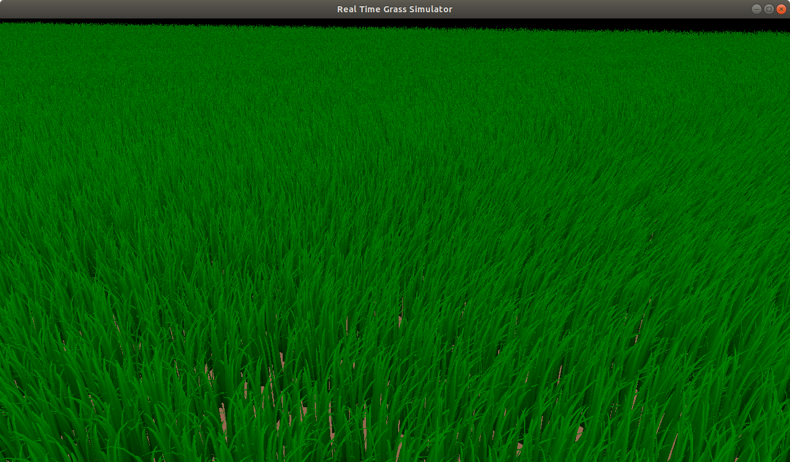

# Real Time Grass Simulator
This project is my implementation of the paper by Jahrmann and Wimmer: [Responsive Real-Time Grass Rendering for General 3D Scenes](https://www.cg.tuwien.ac.at/research/publications/2017/JAHRMANN-2017-RRTG/JAHRMANN-2017-RRTG-draft.pdf). This paper differentiates itself from the field by presenting a method to simulate each blade of grass as an individual geometric object using OpenGL's tessellation pipeline.



## Results
Scene with 7 million blades of grass individually waving accoring to a periodic wind function running at 60 fps on my personal laptop (which has a GTX 1650 gpu). Due to the compression in the gif screen capture tool I used please refer to the picture above for a better idea of the quality and coloring.


This clip shows an example of object collisions and the grass recovery force discussed in section 5.1 of the paper.


## Code Highlights
```main.cpp``` contains the OpenGL setup and loop.

```shaders/grass.tc``` is the tessellation control shader - where the tessellation levels are set.

```shaders/grass.te``` is the tessellation evaluation shader - where the bezier functions from section 6.3 of the paper are implemented.

```shaders/grass_force.comp``` is the compute shader - where the bulk of the paper is implemented; the wind force, the validation model, and collision processing. 

## Building
You will need GLEW, GLFW, and GLM. It also depends on stb for the blade texture but that's included in ```third_party```.

In the root folder run

```mkdir build```

```cd build```

```cmake ../```

```make```